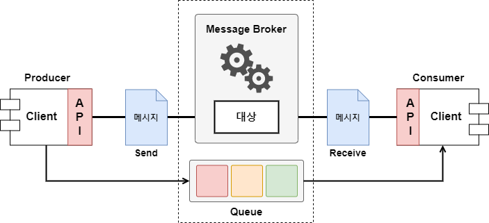

# 메시지 지향 미들웨어 (Message Oriented Middleware, MOM)

> **목차**
>
> 

> 
<strong><a href="./Kafka/README.md">Kafka</a></strong>

>  <!-- -->
> 

>
> 

> 
<strong><a href="./RabbitMQ/README.md">RabbitMQ</a></strong>

>  <!-- -->
> 

>
> 

> 
<a href="./Redis/README.md"><strong>Redis</strong></a>

>  <!-- -->
> 

---

## MOM Summary

**MOM 이란 ?**

응용 소프트웨어 간의 데이터 통신을 위한 소프트웨어이며, 일반적으로 비동기 메시지 전달에 기초한 것을 가리킨다. 많은 메시지 지향 미들웨어는 메시지 큐 시스템을 기반으로 하지만, 그 밖에도 브로드캐스트 형식 메시지 시스템과 멀티 캐스트 형식의 메시지 시스템적인 내용도 있다.

- 미들웨어란 애플리케이션들을 연결해 이들이 서로 데이터를 교환할 수 있게 해주는 소프트웨어
- 메세지 지향 시스템이란 메세지 API를 통해 각 분산되어있는 애플리케이션간의 다리역할을 함으로써 데이터를 교환할 수 있도록 하는 시스템
- 메세지를 통해 여러 분산되어 있는 시스템간의 Connector 역할로 결합성을 낮추고, 이들이 서로 실시간 비동기식 데이터를 교환할 수 있도록 하는 소프트웨어
- 즉, 분산 시스템 간 메시지를 주고 받는 기능을 지원하는 소프트웨어나 하드웨어 인프라

**MOM 특징**

- 비동기 방식으로 메세지를 전달한다.
- Queue, Broadcast, Multicast 등의 방식으로 메세지를 전달한다.
- 메세지를 발행하는 Publisher (Producer), 소비하는 Subscribe (Consumer)로 구성되어 있다.

**MQ(Message Queue) 란?**

- 프로세스 or 프로그램 인스턴스가 데이터를 서로 교환할 때, 사용하는 통신 방법
- Producer, Consumer가 존재하며 Producer는 메세지를 큐에 전송하고 Consumer가 큐의 메세지를 처리하는 방식
- MQ를 사용하면 비동기로 요청을 처리하고 Queue에 저장하여 Consumer에게 병목을 줄여줄 수 있음

- 즉, MOM을 구현한 시스템, 작은 데이터를 빈번하게 전송할 때, 사용하는 시스템

**장점**

- 프로세스 or 프로그램 인스턴스가 데이터를 서로 교환할 때, 사용하는 통신 방법
- Producer, Consumer가 존재하며 Producer는 메세지를 큐에 전송하고 Consumer가 큐의 메세지를 처리하는 방식
- MQ를 사용하면 비동기로 요청을 처리하고 Queue에 저장하여 Consumer에게 병목을 줄여줄 수 있음
- 즉, MOM을 구현한 시스템, 작은 데이터를 빈번하게 전송할 때, 사용하는 시스템

**단점**

- 큐가 가득 차서 더는 큐에 메시지를 저장할 수 없는 상황에는 메시지를 다른 곳에 보존하거나 버림
- 메시지 큐의 크기는 생각보다 작기 때문에 송신측이 수신측보다 빠르다면 문제가 자주 발생할 소지가 있음

**오픈소스 메시지 큐**

- RabbitMQ
- ActiveMQ
- ZeroMQ
- Kafka
- Redis

---

> **참조**
>
> 